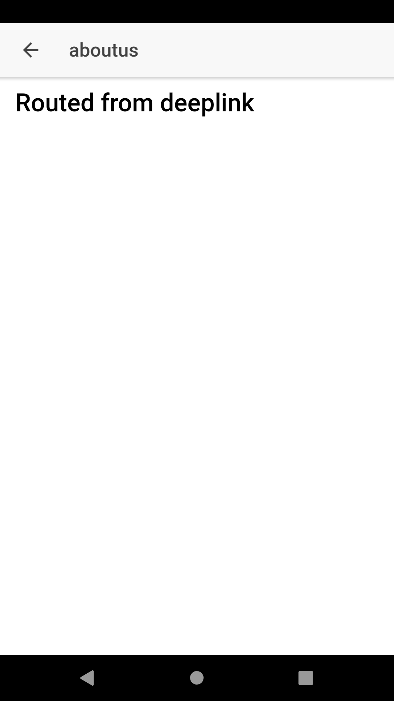
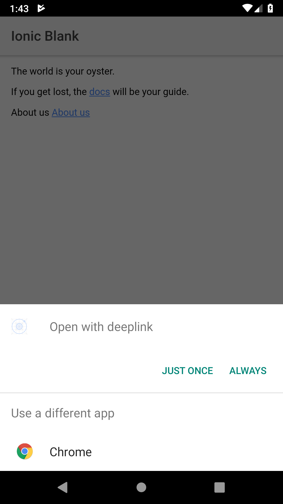

# IONIC - Deeplinking with website urls in mobile app

Deeplinks handles registering and displaying specific views based on URLs from website to inside the app navigation. For example, product purchase from website to open in app. If the app is not installed, it will navigate the user to open the app to download

### Show some :heart: and star the repo to support the project

### Instructions and plugin to link with your app 
```bash
$ ionic start deeplink blank 
$ cd deeplink
$ ionic cordova plugin add ionic-plugin-deeplinks --variable URL_SCHEME=deeplink --variable DEEPLINK_SCHEME=https --variable DEEPLINK_HOST=driftycode.com --variable ANDROID_PATH_PREFIX=/

$ npm install --save @ionic-native/deeplinks
```

### Create navigation links to app pages 

```bash
$ ionic generate page aboutus --no-module // it creates AboutusPage in your pages folder
```

### Copy the below code to your app.component.ts

```
     constructor(platform: Platform, statusBar: StatusBar, splashScreen: SplashScreen, public deeplink: Deeplinks) {
        platform.ready().then(() => {
            statusBar.styleDefault();
            splashScreen.hide();

            // THIS BELOW CODE WILL CHECK FOR DEEPLINKS FROM OTHER APPS OR BROWSER 
            this.deeplink.routeWithNavController(this.navChild, {
                '/about-us': AboutusPage,
                '/universal-links-test': AboutusPage
            }).subscribe((match) => {
                console.log('Successfully routed', match);
            }, (nomatch) => {
                console.warn('Unmatched Route', nomatch);
            });
        });
    }
```

# ACCESSLINK FROM ANOTHER APP OR WEBSITE LINK 

```
  <p>
    About us <a href="https://driftycode.com/about-us">About us</a>
  </p>
```
  
### Screenshots
 
 

### Created & Maintained By

[Nagendra Badiganti](https://github.com/nbadiganti) ([@nagendrabadigan](https://www.twitter.com/nagendrabadigan)) 
([Insta](https://www.instagram.com/nbadiganti))

> If you found this project helpful or you learned something from the source code and want to thank me, consider buying me a cup of :coffee:
>
> * [PayPal](https://www.paypal.me/codingcursor/)

# License

    Copyright 2018 Nagendra Badiganti

    Licensed under the Apache License, Version 2.0 (the "License");
    you may not use this file except in compliance with the License.
    You may obtain a copy of the License at

       http://www.apache.org/licenses/LICENSE-2.0

    Unless required by applicable law or agreed to in writing, software
    distributed under the License is distributed on an "AS IS" BASIS,
    WITHOUT WARRANTIES OR CONDITIONS OF ANY KIND, either express or implied.
    See the License for the specific language governing permissions and
    limitations under the License.

## More info

For help getting started with IONIC and deeplinks, 
[documentation](https://ionicframework.com/docs/native/deeplinks/).
